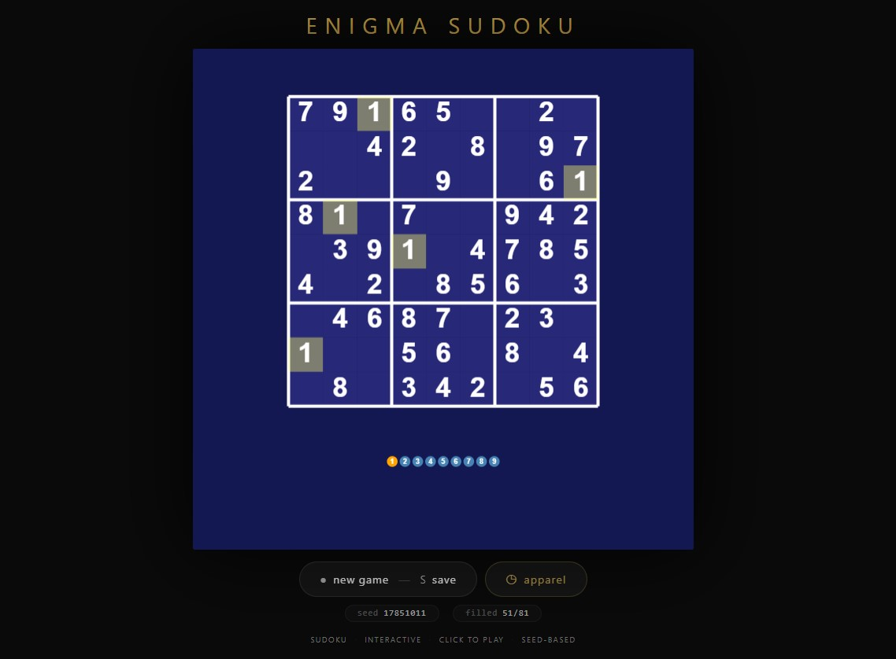

# Ellipses — Generative Art

[](https://reyrove.github.io/Ellipses-Generative-Art)
[](https://opensource.org/licenses/MIT)

> **Generative ellipse art.** Each refresh creates a unique composition of rotating ellipses with vibrant colors, soft shadows, and elegant geometric patterns.

## 🎨 Live Demo

<div align="center">
  <a href="https://reyrove.github.io/Ellipses-Generative-Art" target="_blank">
    
  </a>
  <br><br>
  <a href="https://reyrove.github.io/Ellipses-Generative-Art" target="_blank">
    
  </a>
  <br>
  <em>Click the image or button to experience the generative art</em>
</div>

## 👕 Apparel Preview

<div align="center">
  
  <br>
  <em>Ellipses artwork printed on a T-shirt</em>
</div>

## ✨ Features

- **Rotating Ellipses** — Beautiful rotating ellipse patterns
- **Two Layer System** — Big and small ellipses in different colors
- **Rich Color Palettes** — 12 background, 12 foreground colors
- **Soft Glow Effect** — Elegant shadow blur on ellipses
- **Geometric Harmony** — Symmetrical, rotating compositions
- **Seed-Based** — Every composition is unique and reproducible via its seed
- **Save & Share** — Download as PNG with seed in filename
- **Apparel Mode** — Preview artwork on a T-shirt mockup
- **Responsive** — Works on desktop, tablet, and mobile
- **Pure JavaScript** — No external dependencies
- **Keyboard Shortcuts**:
  - `R` — Regenerate
  - `S` — Save image
  - `T` — Toggle apparel view

## 🎨 Artwork Details

| Parameter | Range | Description |
|-----------|-------|-------------|
| **Big Ellipses** | 2–30 | Large outer ellipses |
| **Small Ellipses** | 2–20 | Small inner ellipses |
| **Background Colors** | 12 options | Soft pastel backgrounds |
| **Big Ellipse Colors** | 12 options | Dark, rich colors |
| **Small Ellipse Colors** | 12 options | Bright, vibrant colors |
| **Shadow Blur** | Variable | Soft glow effect |

## 🎯 How It Works

The artwork creates a layered composition of rotating ellipses:

1. **Setup**:
   - Random background color from 12 soft colors
   - Random big ellipse color from 12 dark colors
   - Random small ellipse color from 12 bright colors
   - Random number of big and small ellipses

2. **Small Ellipses** (Inner Layer):
   - Centered on canvas
   - Rotating around their center
   - Smaller size and line width
   - Bright, vibrant colors

3. **Big Ellipses** (Outer Layer):
   - Centered on canvas with 45° rotation
   - Rotating around their center
   - Larger size and line width
   - Dark, rich colors

4. **Rendering**:
   - Soft shadow glow on all ellipses
   - Elegant geometric composition
   - Symmetrical rotating patterns

## 🚀 Quick Start

### Local Development

```bash
# Clone the repository
git clone https://github.com/reyrove/Ellipses-Generative-Art.git

# Navigate to the directory
cd Ellipses-Generative-Art

# Open in browser
open index.html
# or use a live server
```

### Deploy to GitHub Pages

1. Push to GitHub
2. Go to Settings → Pages
3. Select branch `main` and root folder
4. Your site will be live at `https://reyrove.github.io/Ellipses-Generative-Art`

## 🧠 How It Works

The artwork is generated using a deterministic random number generator, seeded by timestamp + random noise. Every refresh:

1. **Setup**:
   - Random background from 12 pastel colors
   - Random big ellipse color from 12 dark colors
   - Random small ellipse color from 12 bright colors
   - Random count of big ellipses (2-30)
   - Random count of small ellipses (2-20)

2. **Size Calculation**:
   - Big ellipse width: random between w/4 and w/4 + w/8
   - Small ellipse width: random between bigWidth/4 and bigWidth/4 + bigWidth/2
   - Heights are half the width (2:1 ratio)

3. **Rendering**:
   - Small ellipses drawn first (inner layer)
   - Big ellipses drawn second (outer layer)
   - Each ellipse rotates by a fraction of PI
   - Soft shadow blur creates glow effect

## 📁 File Structure

```
Ellipses-Generative-Art/
├── index.html          # Main application (all-in-one)
├── Ellipses.jpg        # T-shirt mockup image
├── fav.svg             # Favicon
├── demo-screenshot.jpg # Website demo screenshot
├── README.md           # This file
└── LICENSE             # MIT License
```

## 🛠️ Tech Stack

- **Pure Vanilla HTML/CSS/JS** — No dependencies
- **Canvas API** — 2D rendering
- **CSS Flexbox/Grid** — Responsive layout
- **GitHub Pages** — Hosting

## 🎯 Interactive Controls

| Action | Keyboard | Button |
|--------|----------|--------|
| Regenerate | `R` | Click "regenerate" |
| Save Image | `S` | Click "regenerate" |
| Toggle Apparel | `T` | Click "apparel" |

## 🎨 The Creative Process

### Color Palettes
- **Background**: 12 soft pastel colors (pink, peach, yellow, lavender, green, cyan, etc.)
- **Big Ellipses**: 12 dark, rich colors (dark red, indigo, teal, maroon, purple, etc.)
- **Small Ellipses**: 12 bright, vibrant colors (yellow, magenta, cyan, gold, etc.)

### Ellipse Geometry
Each ellipse has a 2:1 width-to-height ratio, creating elegant oval shapes. The rotation creates a mandala-like pattern.

### Layer System
- **Inner Layer**: Small ellipses create intricate patterns
- **Outer Layer**: Big ellipses frame the composition
- **Combined**: Creates depth and visual interest

### Glow Effect
A soft shadow blur adds a gentle glow to each ellipse, enhancing the dreamy, elegant feel of the artwork.

## 📱 Responsive Design

The application automatically adapts to:
- Desktop screens
- Tablets
- Mobile phones
- Landscape orientation
- Various aspect ratios

## 🤝 Contributing

Contributions are welcome! Feel free to:
- Fork the repository
- Create a feature branch
- Submit a pull request

### Ideas for Contributions:
- New color palettes
- Additional ellipse patterns
- Animation features
- Interactive controls
- Performance optimizations

## 📄 License

MIT License — see [LICENSE](LICENSE) file for details.

## 🙏 Acknowledgments

- Inspired by geometric art and mandalas
- Pure JavaScript implementation
- Special thanks to the creative coding community

---

**Built with ❤️ and elegant ellipses**